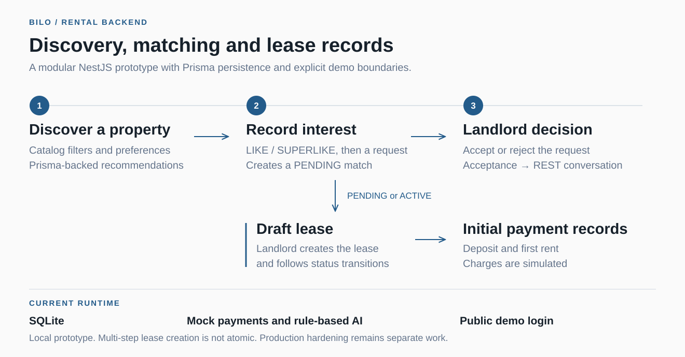

# BILO

Prototipo de backend de alquileres que conecta descubrimiento de propiedades, interés del inquilino, decisiones del propietario y registros de contratos. El foco inicial del producto es la vivienda estudiantil en Costa Rica.

**NestJS · TypeScript · Prisma · SQLite**

[English](./README.md) · [Diseño técnico](./docs/design/README.md) · [Requisitos](./docs/requirements/README.md)



## Recorrido implementado

- Catálogo de propiedades activas, filtros y recomendaciones basadas en preferencias.
- Swipes de interés y solicitudes de match entre inquilino y propietario.
- Aceptación o rechazo por el propietario; al aceptar se intenta crear una conversación REST.
- Creación de un lease en borrador desde un match pendiente o activo, cambios de estado y registros iniciales de depósito y alquiler.
- Mensajes, ratings, eventos de confianza, disputas, notificaciones y auditoría persistidos.

La API es un monolito modular: controladores y servicios por dominio, persistencia con Prisma y eventos dentro del proceso. Incluye autenticación JWT, controles de rol y propiedad, validación de DTOs y OpenAPI.

## Límites actuales

SQLite es la persistencia actual. Los pagos se simulan con `stripe_mock`; la IA responde con reglas y contexto local. Neo4j es un adaptador sin implementar. El chat usa REST; no hay WebSocket ni envío externo de notificaciones.

`POST /api/v1/auth/mock-login` es público y entrega tokens a partir de un correo sin comprobar credenciales. El entorno de producción no desactiva esa ruta. La creación de leases incluye varias escrituras sin una transacción única. El prototipo sirve para exploración local; la documentación de producción describe trabajo futuro.

## Ejecución

Usa una base local desechable. El bootstrap de Docker ejecuta `prisma db push --accept-data-loss` y puede alterar el esquema y los datos. No lo conectes a una base que debas conservar ni expongas públicamente la demo.

Con Docker y Compose:

```bash
cp .env.example .env
docker compose up --build
```

El backend queda en `http://localhost:3001`; OpenAPI en `/api/v1/docs`, health en `/api/v1/health` y health de base en `/api/v1/health/db`. Los datos se montan desde `./data`.

Antes de iniciar, agrega `SEED_MODE=basic` a `.env` para usar el seed incluido sin enriquecimiento externo. El seed automático se ejecuta cuando no hay propiedades; `AUTO_SEED=false` lo desactiva. El modo predeterminado intenta enriquecimiento externo con datos de respaldo.

Con Node.js 20:

```bash
cp .env.example .env
npm install --legacy-peer-deps
npm run prisma:generate
npm run prisma:push
npm run prisma:seed
npm run start:dev
```

Este modo usa el puerto 3000. El login de demostración permite explorar Swagger sin Google; OAuth real requiere credenciales y un callback que coincida con el puerto.

## Verificación y herramientas

`npm run build` compila TypeScript. No hay suite automatizada ni script de pruebas en `package.json`. La [estrategia de pruebas](./docs/design/11-testing-strategy.md) corresponde al diseño futuro.

- `npm run prisma:studio`: inspección de datos locales.
- `npm run prisma:seed:live`: enriquecimiento externo con fallbacks.
- `npm run seed:sqlite:inside-airbnb`: catálogo SQLite exploratorio independiente; no alimenta automáticamente las tablas Prisma. [Supuestos y límites](./docs/sqlite-realistic-seeding.md).

## Equipo y documentación

Proyecto de equipo nacido en un hackathon. [Joshua Corrales](https://github.com/joshuacorraless) participó en el prototipo y en la documentación posterior de arquitectura, requisitos y producto. [José Fabián Zumbado](https://github.com/JoseZum) contribuyó a la implementación inicial del backend.

Se conservan las guías de [diseño técnico](./docs/design/README.md), [requisitos](./docs/requirements/README.md), [producto y negocio](./docs/business/README.md) e [investigación legal de Costa Rica](./docs/legal/costa-rica/README.md). Esta última prepara preguntas para asesoría profesional; no constituye asesoría legal.

El paquete está marcado `UNLICENSED`.
